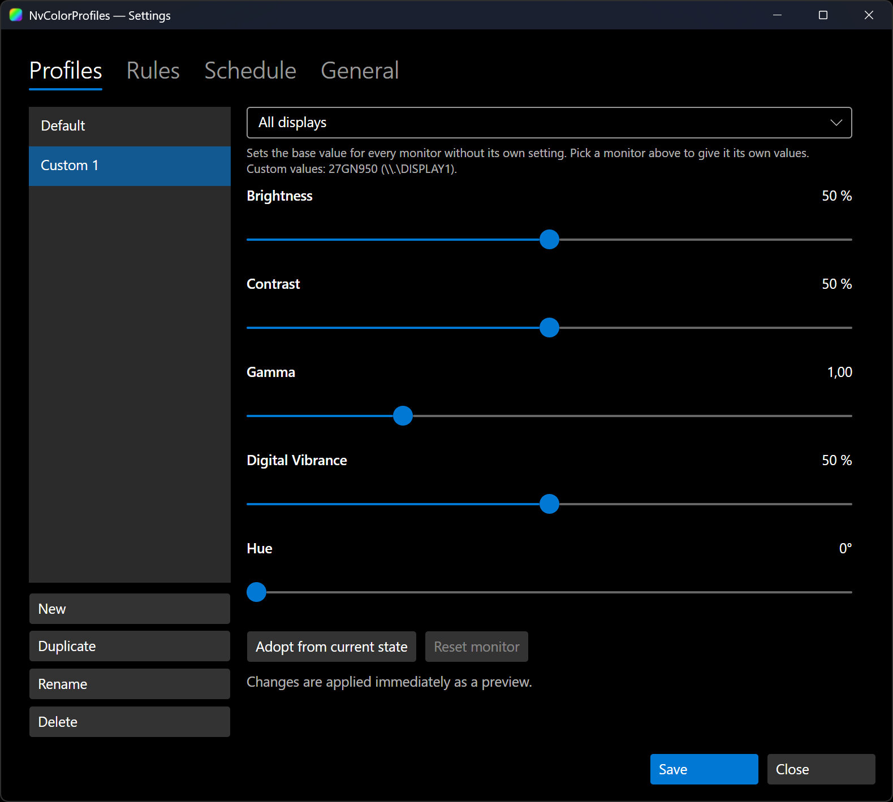
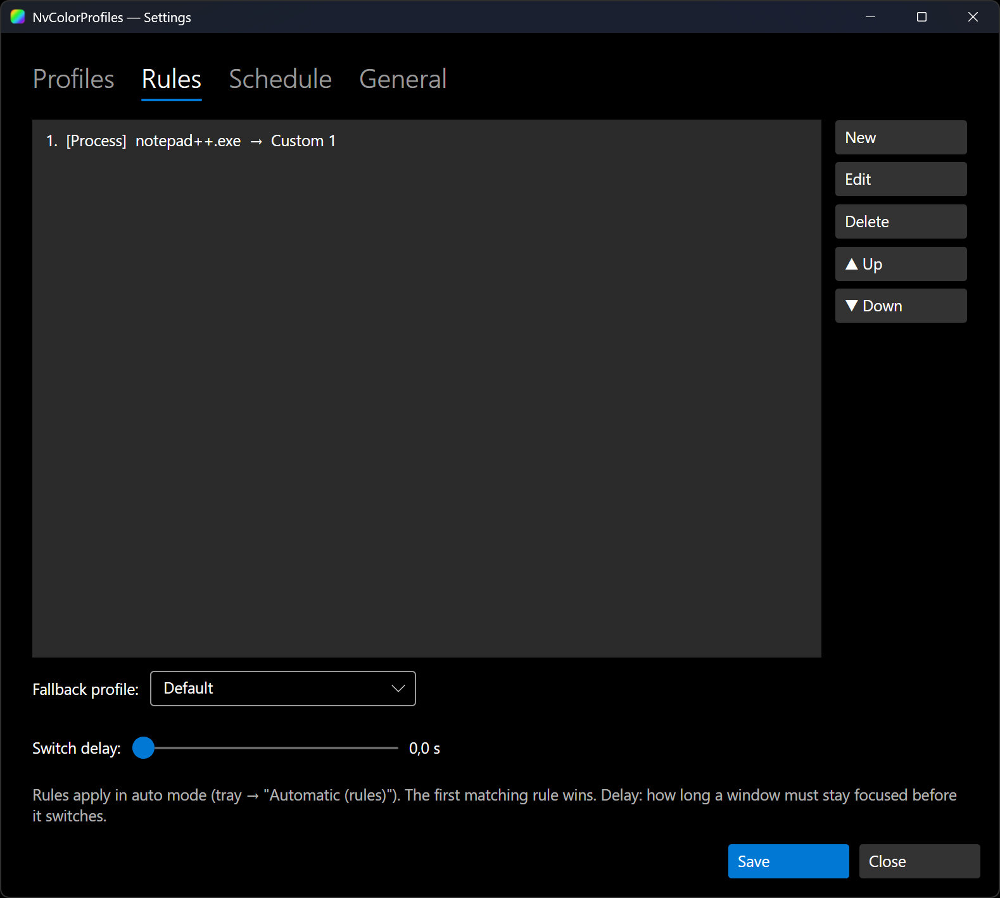
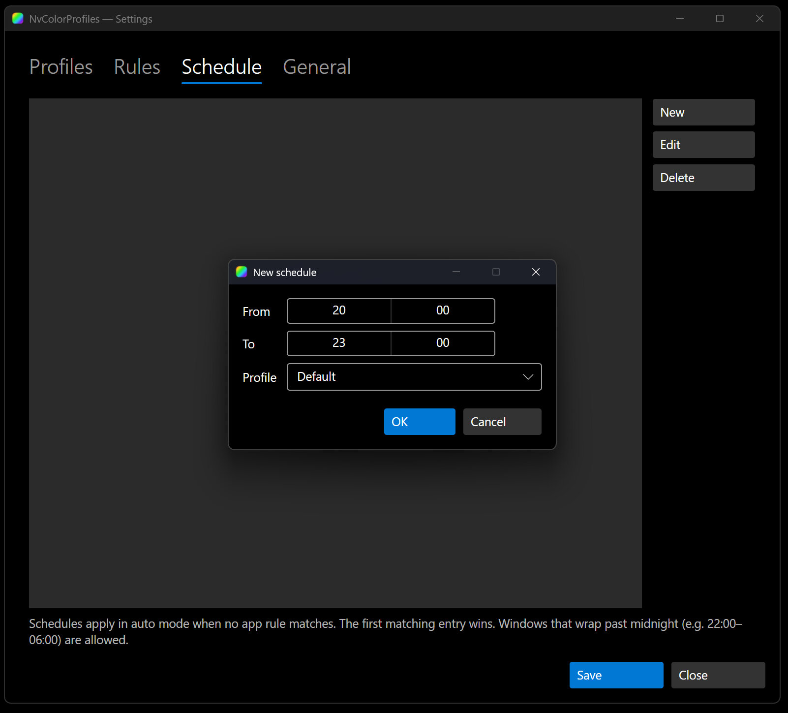
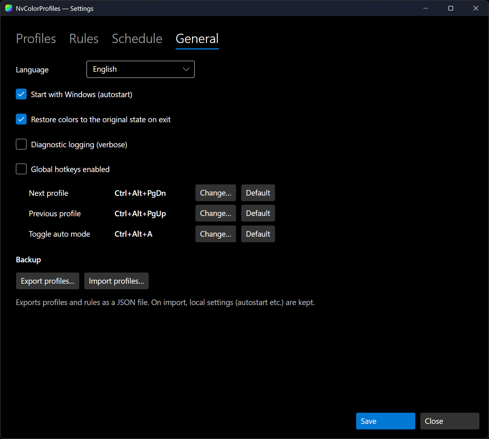
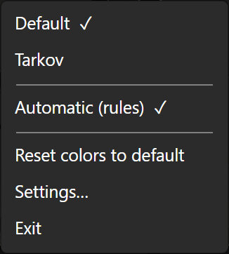
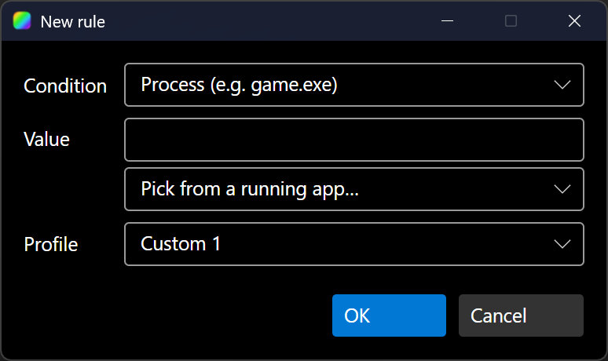

# NvColorProfiles

A Windows tray app to manage NVIDIA display color settings (brightness, contrast, gamma, digital vibrance and hue) with named profiles and automatic switching based on the running application, the time of day, or a hotkey.

It does what the NVIDIA Control Panel's *Adjust Desktop Color Settings* page does, and adds the two things that panel lacks: **your own named profiles** and a **rule engine** that switches them automatically (punchy colors in a game, neutral colors on the desktop). Think of it as the slider coverage of NvidiaDisplayController combined with the per-app auto-switching of VibranceGUI.

> **Not affiliated with, endorsed by, or sponsored by NVIDIA Corporation.**
> "NVIDIA" is a trademark of NVIDIA Corporation, used here only descriptively to identify the GPUs this tool works with.

## Screenshots

| Profiles | Rules |
|----------|-------|
|  |  |
| **Schedule** | **General** |
|  |  |

<table>
  <tr>
    <td align="center"><b>Tray menu</b> </td>
    <td align="center"><b>New rule</b> </td>
  </tr>
</table>

## Features

- All five output adjustments: **Brightness, Contrast, Gamma, Digital Vibrance, Hue**. (The "Color channel" selector is intentionally left out; all channels are adjusted together.)
- **Unlimited named profiles**, including a read-only **Default** (NVIDIA neutral values).
- **System tray icon** with a context menu to switch profiles instantly.
- **Rule engine**: auto-switch profiles by process name or window title (regex), with a fallback profile and a configurable switch delay. A **process picker** lists running apps so you don't have to type the executable name.
- **Time schedule**: switch profiles by time of day, with windows that wrap past midnight. Precedence in auto mode is app rule, then schedule, then fallback.
- **Global hotkeys** to cycle profiles and toggle auto mode from anywhere. Freely rebindable.
- **Multi-monitor**: per-display settings within a profile, with real monitor model names.
- **Live preview** while adjusting the sliders.
- **Re-applies automatically** after standby/resume, a resolution change or exclusive fullscreen, since Windows wipes the gamma ramp on those.
- **Import / export** your profiles, rules and schedules as a JSON file.
- **German and English UI**, auto-detected from the system language and switchable in the settings.
- **Autostart** with Windows, and **reset to defaults** from the tray.

## Installation

Download the latest build from the [Releases page](https://github.com/0skater0/NvColorProfiles/releases):

- **Installer** (`nvcolorprofiles-setup.exe`): per-user install (no admin), Start-Menu shortcut, optional desktop shortcut and autostart, with an uninstaller.
- **Portable** (`NvColorProfiles.exe`): a single self-contained executable. No install, no .NET runtime needed. Just run it.

Both downloads are the same self-contained build, so neither needs the .NET runtime or any other prerequisite.

Either way a tray icon appears; right-click it for the menu.

### Requirements

- Windows 10 or 11 (x64)
- An NVIDIA GPU with current drivers

## Usage

The UI is German or English (auto-detected; switch under **Settings → General → Language**). Menu names below use the English labels.

1. **Create a profile:** right-click the tray icon, open **Settings → Profiles → New**. Pick a monitor (or *All displays*) and adjust the sliders; the display updates live. **Save**.
2. **Switch manually:** right-click the tray icon and pick a profile.
3. **Auto-switch per app:** **Settings → Rules → New**, choose *Process* and the executable name (e.g. `game.exe`) or pick it from the running-apps list, then choose the target profile. Set a fallback profile and an optional switch delay, and enable **Automatic (rules)** in the tray menu. The matching profile applies while that app is focused; the fallback applies otherwise.
4. **Auto-switch by time:** **Settings → Schedule → New**, set a *from*/*to* window and a profile. It applies in auto mode when no app rule matches.
5. **Hotkeys:** with **Global hotkeys** enabled (**Settings → General**), `Ctrl+Alt+PageDown` / `PageUp` cycle profiles and `Ctrl+Alt+A` toggles auto mode. Rebind them under the same tab.
6. **Back up or move your config:** **Settings → General → Export / Import profiles**.
7. **Reset:** tray → **Reset colors to default** restores NVIDIA neutral values.

## How it works

Brightness, contrast and gamma are applied through the Windows gamma ramp (the same mechanism the NVIDIA panel uses for those three sliders); digital vibrance and hue go through NvAPI. The codebase is split into a platform-agnostic core (gamma math, profiles, rules) and a Windows-only Avalonia tray app. See [CONTRIBUTING.md](CONTRIBUTING.md) for the development setup.

## Reporting bugs

Please open an issue with:

1. **App version** (the installer/portable file name, or the version in the executable's *Details* tab)
2. **NVIDIA driver version** and **GPU model**
3. **Windows version**
4. **Steps to reproduce**, plus what you expected versus what happened
5. **The log file** if you can reproduce with diagnostic logging on (Settings → General → Diagnostic logging), found at `%APPDATA%\NvColorProfiles\logs\`
6. **Screenshots or a short recording** if it's a UI issue

> Reports that only say *"it doesn't work"* can't be investigated. Details make the difference.

## Contributing

See [CONTRIBUTING.md](CONTRIBUTING.md) for the development setup, build instructions, and the PR process.

## License

[MIT](LICENSE) © 0skater0 — provided as-is, no warranty.

This project's own code is MIT. It also uses two LGPL-3.0 components by Soroush Falahati: the gamma-ramp curve formula in `gamma_ramp.cs` is derived from [WindowsDisplayAPI](https://github.com/falahati/WindowsDisplayAPI) (LGPL-3.0), and NvAPI access uses [NvAPIWrapper.Net](https://github.com/falahati/NvAPIWrapper) (LGPL-3.0), bundled unmodified. Those parts stay under the LGPL-3.0 and are not relicensed by the MIT license; you can replace the library and rebuild from this public source. Full third-party attributions and the LGPL/GPL texts are in [NOTICE](NOTICE), [COPYING.LESSER](COPYING.LESSER) and [COPYING](COPYING).

## Support

If this saved you some squinting, you can buy me a coffee:

