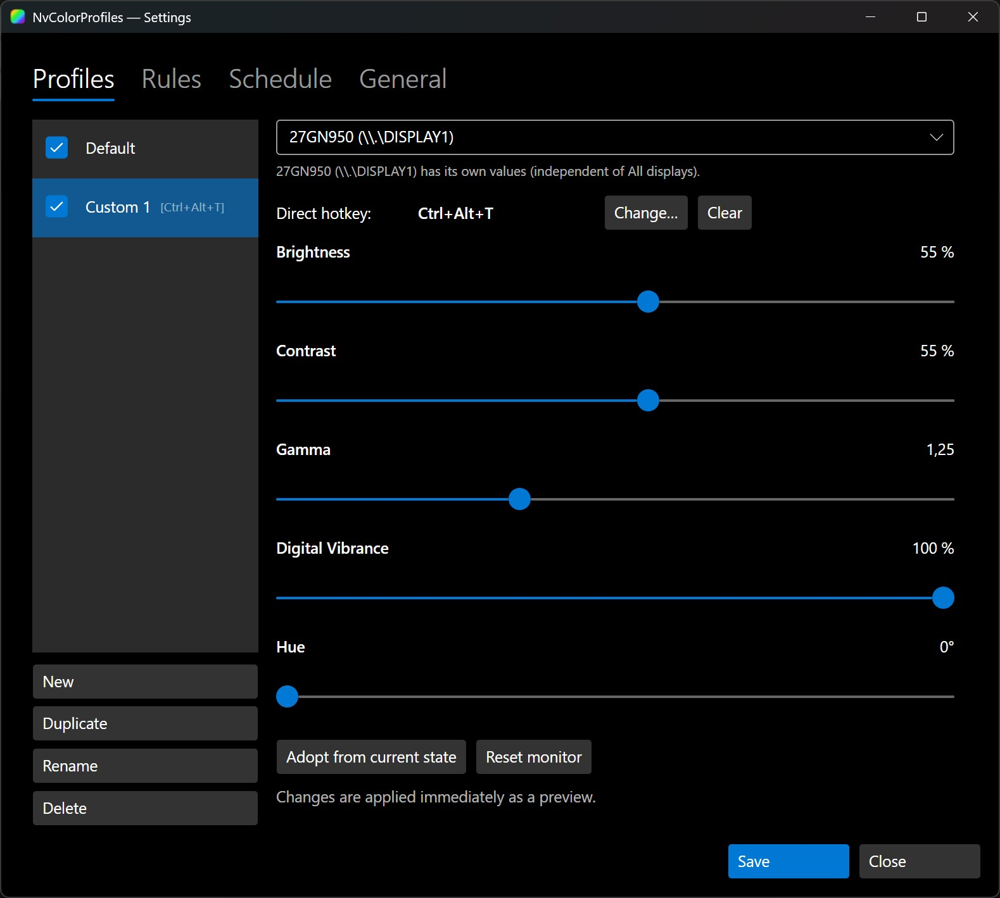
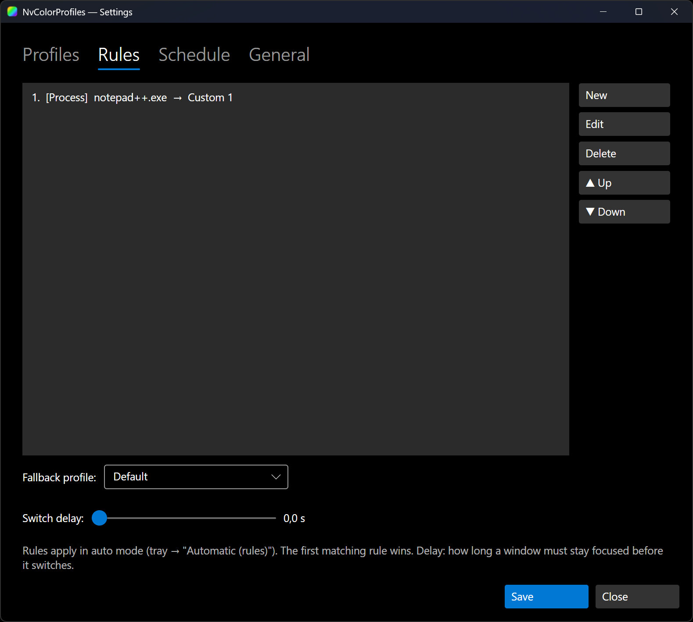
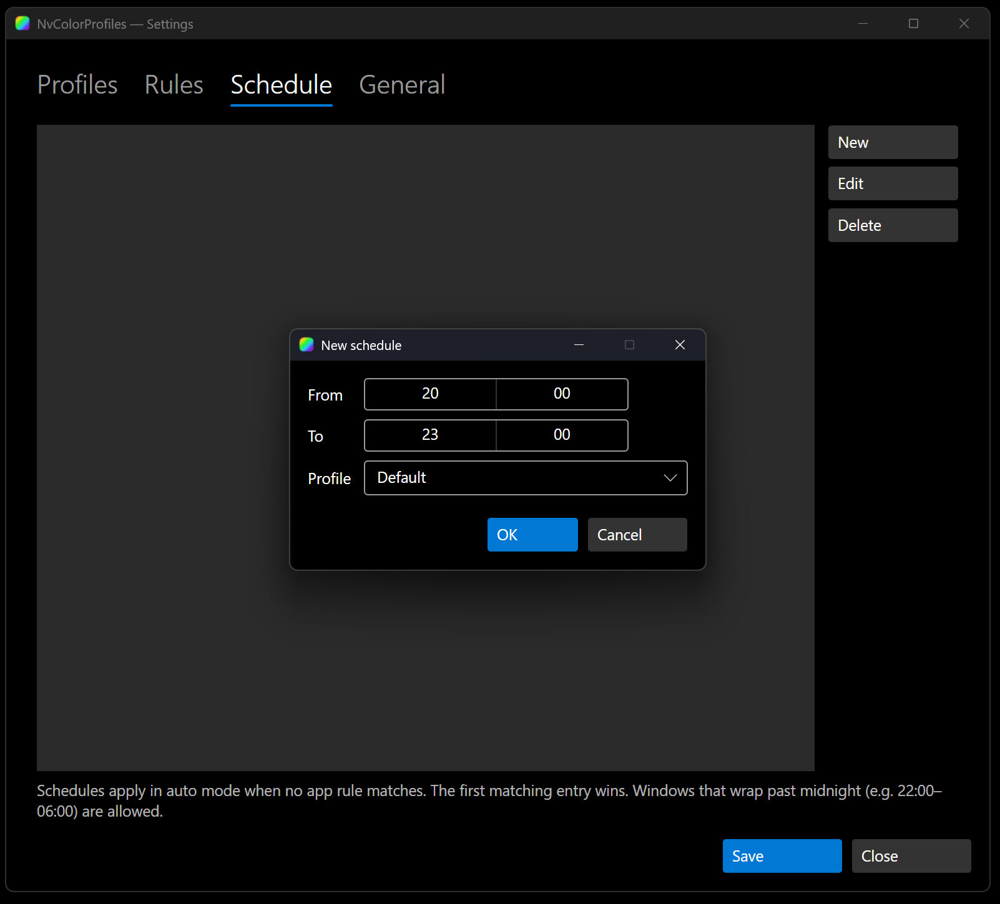
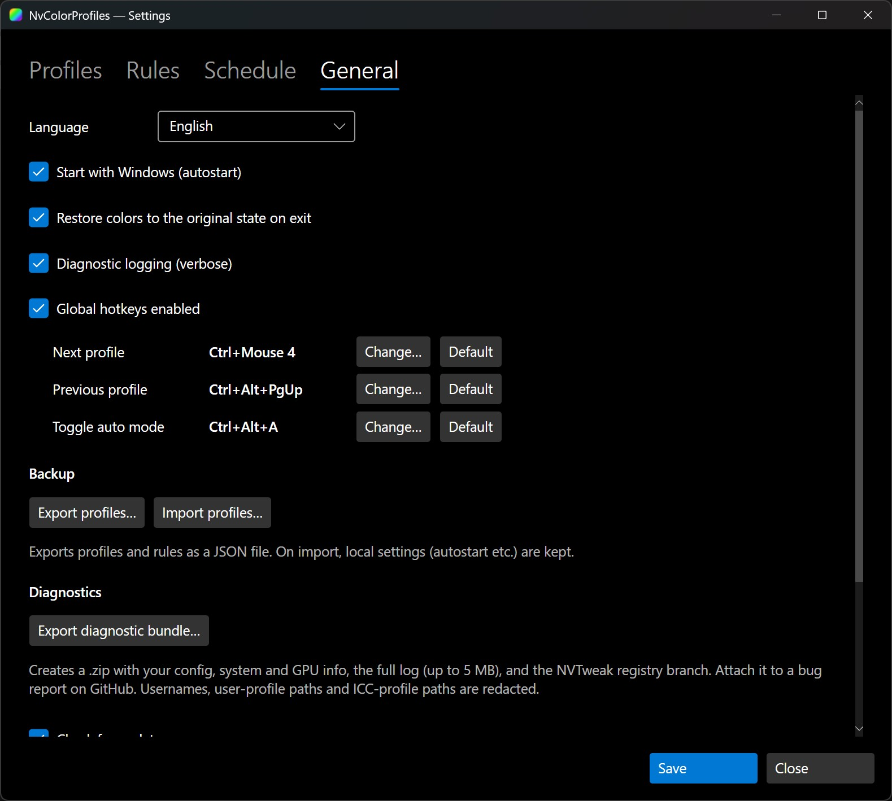
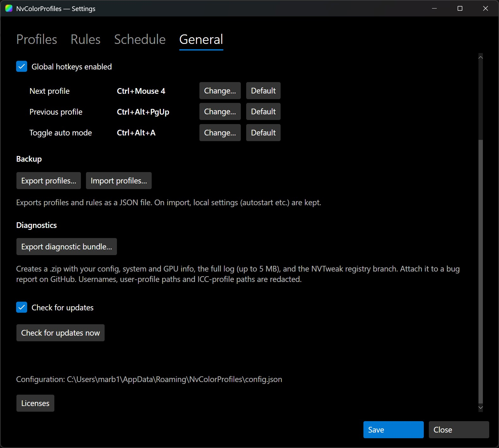
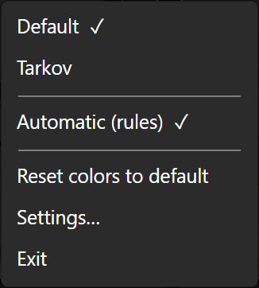
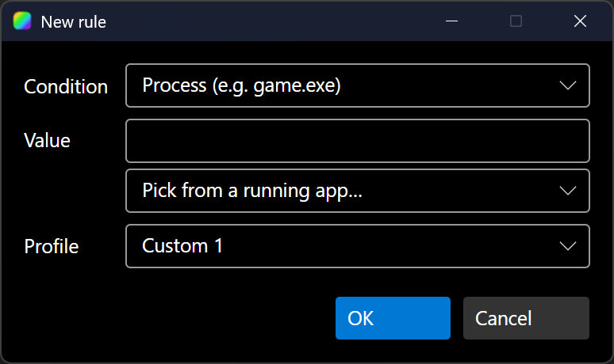

# NvColorProfiles


A Windows tray app to manage NVIDIA display color settings (brightness, contrast, gamma, digital vibrance and hue) with named profiles and automatic switching based on the running application, the time of day, or a hotkey.

It does what the NVIDIA Control Panel's *Adjust Desktop Color Settings* page does, and adds the two things that panel lacks: **your own named profiles** and a **rule engine** that switches them automatically (punchy colors in a game, neutral colors on the desktop). Think of it as the slider coverage of NvidiaDisplayController combined with the per-app auto-switching of VibranceGUI.

> **Not affiliated with, endorsed by, or sponsored by NVIDIA Corporation.**
> "NVIDIA" is a trademark of NVIDIA Corporation, used here only descriptively to identify the GPUs this tool works with.

## Screenshots

| Profiles | Rules |
|----------|-------|
|  |  |
| **Schedule** | **General (top)** |
|  |  |
| **General (bottom)** | |
|  | |

<table>
  <tr>
    <td align="center"><sub><b>Tray menu</b></sub><br></td>
    <td align="center"><sub><b>New rule</b></sub><br></td>
  </tr>
</table>

## Features

- All five output adjustments: **Brightness, Contrast, Gamma, Digital Vibrance, Hue**. (The "Color channel" selector is intentionally left out; all channels are adjusted together.)
- **Unlimited named profiles**, including a read-only **Default** (NVIDIA neutral values).
- **System tray icon** with a context menu to switch profiles instantly.
- **Rule engine**: auto-switch profiles by process name or window title (regex), with a fallback profile and a configurable switch delay. A **process picker** lists running apps so you don't have to type the executable name.
- **Time schedule**: switch profiles by time of day, with windows that wrap past midnight. Precedence in auto mode is app rule, then schedule, then fallback.
- **Multi-monitor**: per-display settings within a profile, with real monitor model names.
- **Live preview** while adjusting the sliders.
- **Import / export** your profiles, rules and schedules as a JSON file.
- **German and English UI**, auto-detected from the system language and switchable in the settings.
- **Autostart** with Windows, and **reset to defaults** from the tray.

### Gamma survives exclusive-fullscreen games

Gamma is applied through the NVIDIA display pipeline LUT instead of the Windows gamma ramp. Exclusive-fullscreen games no longer wipe it, so a profile tuned for a specific game stays applied while you play. Brightness and contrast still use the gamma ramp and are re-applied automatically after standby/resume, resolution changes and fullscreen transitions.

### Hotkeys

- **Global cycle and toggle hotkeys** to step through profiles and toggle auto mode from anywhere. Freely rebindable under **Settings → General**.
- **Per-profile direct hotkey**: any profile can be given its own hotkey that applies it immediately. Set it on the Profiles tab; a small suffix in the profile list shows which key is bound. Conflicts with other profile hotkeys or the global cycle/toggle bindings are shown as a warning under the picker but not blocked, so you can move bindings around freely.
- **Include in cycle**: a checkbox next to each profile in the list controls whether the next/previous cycle hotkeys land on it. Handy for keeping the read-only Default out of a two-profile day/night rotation.
- **Side mouse buttons as triggers**: any hotkey (global or per-profile) accepts a modifier (Ctrl/Alt/Shift/Win) plus mouse button 4 (XButton1) or 5 (XButton2). Bare side buttons stay pass-through so browser back/forward keeps working.

### Diagnostic bundle

**Settings → General → Export diagnostic bundle** writes a zip you can attach to a bug report. It contains the config file, GPU and driver info, the log file (capped at 5 MB), and the relevant NVTweak registry branch. Personal data (Windows usernames, user-profile paths, ICC-profile paths) is redacted before the zip is written.

### Optional update check

Off by default. On first launch the app asks once whether it may check GitHub for new releases. If enabled, it polls the GitHub releases API roughly once a day; a new version shows a Windows toast with the app icon and marks the tray icon. The Settings → General tab also has a **Check now** button and toggles for turning the check back on or off. Until the first-run prompt is answered, the app makes no network requests.

## Installation

Download the latest build from the [Releases page](https://github.com/0skater0/NvColorProfiles/releases):

- **Installer** (`nvcolorprofiles-setup.exe`): per-user install (no admin), Start-Menu shortcut, optional desktop shortcut and autostart, with an uninstaller.
- **Portable** (`NvColorProfiles.exe`): a single self-contained executable. No install, no .NET runtime needed. Just run it.

Both downloads are the same self-contained build, so neither needs the .NET runtime or any other prerequisite.

Either way a tray icon appears; right-click it for the menu.

### Requirements

- Windows 10 or 11 (x64)
- An NVIDIA GPU with current drivers

## Usage

The UI is German or English (auto-detected; switch under **Settings → General → Language**). Menu names below use the English labels.

1. **Create a profile:** right-click the tray icon, open **Settings → Profiles → New**. Pick a monitor (or *All displays*) and adjust the sliders; the display updates live. Optionally set a direct hotkey for the profile and use the "include in cycle" checkbox to control whether the next/previous hotkey lands on it. **Save**.
2. **Switch manually:** right-click the tray icon and pick a profile, or press its direct hotkey.
3. **Auto-switch per app:** **Settings → Rules → New**, choose *Process* and the executable name (e.g. `game.exe`) or pick it from the running-apps list, then choose the target profile. Set a fallback profile and an optional switch delay, and enable **Automatic (rules)** in the tray menu. The matching profile applies while that app is focused; the fallback applies otherwise.
4. **Auto-switch by time:** **Settings → Schedule → New**, set a *from*/*to* window and a profile. It applies in auto mode when no app rule matches.
5. **Hotkeys:** with **Global hotkeys** enabled (**Settings → General**), `Ctrl+Alt+PageDown` / `PageUp` cycle profiles and `Ctrl+Alt+A` toggles auto mode. Rebind them under the same tab. Bindings accept a modifier plus a key or side mouse button (Mouse4/Mouse5).
6. **Back up or move your config:** **Settings → General → Export / Import profiles**.
7. **Reset:** tray → **Reset colors to default** restores NVIDIA neutral values.

## Configuration file location

Settings, profiles, rules and the schedule live in

```
%APPDATA%\NvColorProfiles\
```

with logs (when diagnostic logging is enabled) under `%APPDATA%\NvColorProfiles\logs\`.

## How it works

Brightness and contrast are applied through the Windows gamma ramp (the same mechanism the NVIDIA panel uses for those two sliders). Gamma is applied through the NVIDIA display pipeline LUT via NvAPI, which survives exclusive-fullscreen games that overwrite the GDI ramp. Digital vibrance and hue also go through NvAPI. The codebase is split into a platform-agnostic core (gamma math, profiles, rules) and a Windows-only Avalonia tray app. See [CONTRIBUTING.md](CONTRIBUTING.md) for the development setup.

## Reporting bugs

Please open an issue with:

1. **App version** (the installer/portable file name, or the version in the executable's *Details* tab)
2. **NVIDIA driver version** and **GPU model**
3. **Windows version**
4. **Steps to reproduce**, plus what you expected versus what happened
5. **A diagnostic bundle** if you can reproduce it: turn on Settings → General → Diagnostic logging, reproduce the problem, then click **Export diagnostic bundle** and attach the resulting zip. Personal data is redacted before packaging.
6. **Screenshots or a short recording** if it's a UI issue

> Reports that only say *"it doesn't work"* can't be investigated. Details make the difference.

## Contributing

See [CONTRIBUTING.md](CONTRIBUTING.md) for the development setup, build instructions, and the PR process.

## License

[MIT](LICENSE) © 0skater0, provided as-is, no warranty.

This project's own code is MIT. It also uses two LGPL-3.0 components by Soroush Falahati: the gamma-ramp curve formula in `gamma_ramp.cs` is derived from [WindowsDisplayAPI](https://github.com/falahati/WindowsDisplayAPI) (LGPL-3.0), and NvAPI access uses [NvAPIWrapper.Net](https://github.com/falahati/NvAPIWrapper) (LGPL-3.0), bundled unmodified. Those parts stay under the LGPL-3.0 and are not relicensed by the MIT license; you can replace the library and rebuild from this public source. Full third-party attributions and the LGPL/GPL texts are in [NOTICE](NOTICE), [COPYING.LESSER](COPYING.LESSER) and [COPYING](COPYING).

## Support

If this saved you some squinting, you can buy me a coffee:

[](https://ko-fi.com/skater_)
